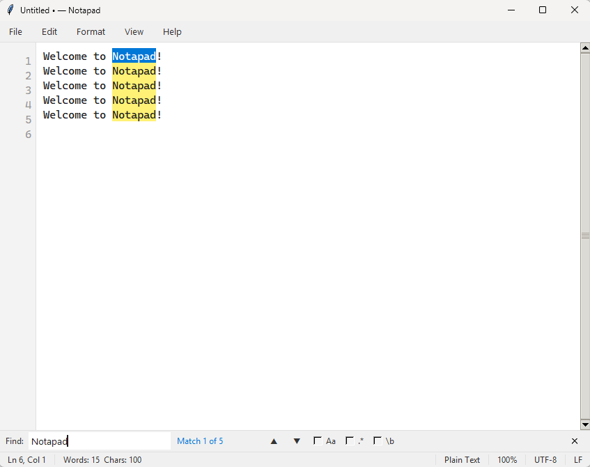

# Notapad


**Notapad** is a lightweight, high-performance, and modular text editor built with Python and Tkinter. Designed to overcome the limitations of standard text editors on Windows (like focus-loss bugs in custom menus), Notapad provides a smooth, modern editing experience with a focus on speed and reliability.



---

## ✨ Key Features

- 🏗️ **Modular Architecture**: A clean, maintainable codebase split into specialized modules under `notapad_app/`.
- 🎨 **AntiqueMenu System**: A custom-engineered, frame-based menu system that eliminates the common "focus loss" issues found in native Tkinter `Toplevel` menus on Windows.
- 🌈 **Viewport-Scoped Highlighting**: High-performance syntax highlighting that only processes what you see, allowing for smooth editing even in larger files.
- 🌓 **Theme Aware**: Supports system-synced Dark and Light modes, including custom Windows title bar styling for a truly native feel.
- 🔍 **Sublime-Style Searching**: Includes an inline, slide-in search bar with regex support, wrap-around indicators, and real-time result counting.
- 📂 **Smart File Handling**:
    - Automatic encoding detection via `chardet`.
    - EOL detection (`\n`, `\r\n`, `\r`) preserving original endings on save.
    - External change detection with a non-blocking reload prompt.
    - Persistent "Recent Files" list and session restoration (cursor position, window geometry).
- ⌨️ **Developer Friendly**: Auto-indentation, smart bracket matching, customizable tab sizes (spaces vs. tabs), and zoom support.
- 🖱️ **Drag & Drop**: Effortlessly open files by dropping them directly into the editor.

---

## 🚀 Getting Started

### Prerequisites

- Python 3.8 or higher.
- `pip` for package management.

### Installation

1. Clone the repository:
   ```bash
   git clone https://github.com/yourusername/notapad.git
   cd notapad
   ```

2. (Optional) Create and activate a virtual environment:
   ```bash
   python -m venv .venv
   source .venv/bin/activate  # On Windows: .venv\Scripts\activate
   ```

3. Install dependencies:
   ```bash
   pip install -r requirements.txt
   ```

### Running the App

Simply run the main entry point:
```bash
python notapad.py
```

---

## 🛠️ Build & Distribution

To package Notapad into a standalone executable (Windows), use the provided PyInstaller spec:

```bash
pyinstaller notapad.spec
```
The output will be located in the `dist/` directory.

---

## 📚 Supported Languages

Notapad currently supports syntax highlighting for over 17 languages and formats:

| Category      | Languages / Formats |
|---------------|---------------------|
| **Core**      | Python, JavaScript, TypeScript |
| **Web**       | HTML, CSS, XML |
| **Data/Config**| JSON, YAML, TOML, INI, SQL |
| **Systems**   | Rust, Go, Java |
| **Scripting** | Shell (Bash/Zsh), Batch |
| **Docs**      | Markdown |

---

## ⚙️ Project Structure

```text
notapad/
├── notapad.py           # Main entry point & orchestrator
├── notapad_app/         # Core application logic
│   ├── config.py        # Shared configurations & syntax patterns
│   ├── ui_engine.py     # Custom UI components (AntiqueMenu)
│   ├── editor.py        # Syntax highlighting engine
│   ├── settings.py      # Persistent user settings
│   └── dialogs.py       # Modal & non-modal dialogs
├── requirements.txt     # External dependencies
└── notapad.spec        # PyInstaller build configuration
```

---

## 📝 License

Distributed under the MIT License. See `LICENSE` for more information.

---

*Designed with ❤️ by the Notapad Team.*
